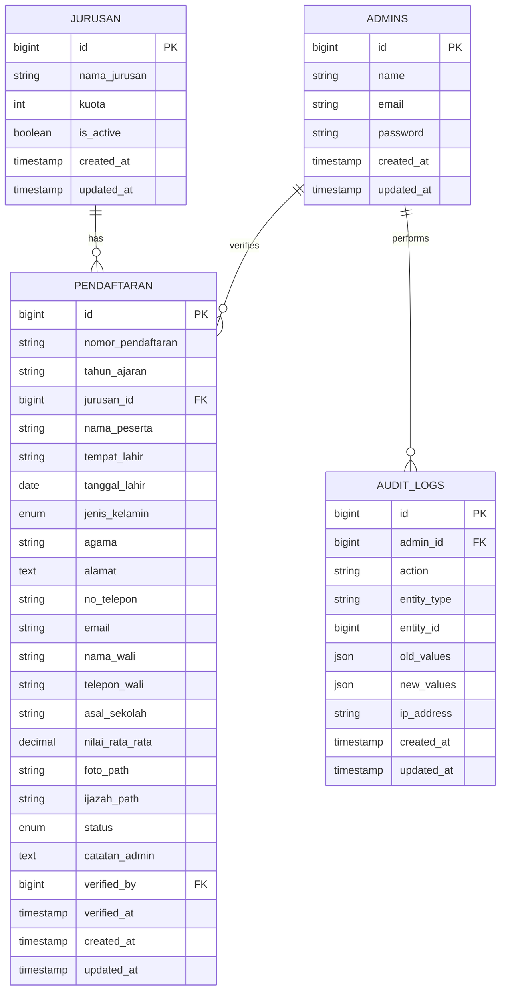

# Entity Relationship Diagram

```mermaid
erDiagram
    ADMINS ||--o{ PENDAFTARAN : "verifies"
    ADMINS ||--o{ AUDIT_LOGS : "performs"
    JURUSAN ||--o{ PENDAFTARAN : "has"

    ADMINS {
        bigint id PK
        string name
        string email
        string password
        timestamp created_at
        timestamp updated_at
    }

    JURUSAN {
        bigint id PK
        string nama_jurusan
        int kuota
        boolean is_active
        timestamp created_at
        timestamp updated_at
    }

    PENDAFTARAN {
        bigint id PK
        string nomor_pendaftaran
        string tahun_ajaran
        bigint jurusan_id FK
        string nama_peserta
        string tempat_lahir
        date tanggal_lahir
        enum jenis_kelamin
        string agama
        text alamat
        string no_telepon
        string email
        string nama_wali
        string telepon_wali
        string asal_sekolah
        decimal nilai_rata_rata
        string foto_path
        string ijazah_path
        enum status
        text catatan_admin
        bigint verified_by FK
        timestamp verified_at
        timestamp created_at
        timestamp updated_at
    }

    AUDIT_LOGS {
        bigint id PK
        bigint admin_id FK
        string action
        string entity_type
        bigint entity_id
        json old_values
        json new_values
        string ip_address
        timestamp created_at
        timestamp updated_at
    }
```